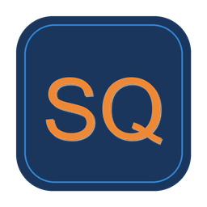

<p align="center">
  
</p>

<h1 align="center">SolvX QuickPod</h1>

<p align="center">
  <strong>One-click AI chat on RunPod cloud GPUs</strong>
</p>

<p align="center">
  <a href="https://github.com/tradewithmeai/solvx-quickpod/actions/workflows/build.yml">
    
  </a>
  <a href="LICENSE">
    
  </a>
  
</p>

<p align="center">
  <!-- TODO: Add screenshot here -->
  <!--  -->
</p>

---

## Features

- **One-Click Launch** - Download, run, chat. No complex setup.
- **Cloud GPU Power** - RTX 3090 running Mistral-7B-Instruct
- **Guided Onboarding** - First-run wizard walks you through RunPod signup
- **Session Recovery** - Reconnect to running pods automatically
- **Debug Mode** - View raw JSON API exchanges with `/json`
- **Exit Protection** - Prompts to terminate pod on exit to prevent surprise charges
- **Open Source** - All code available, learn how it works

## Quick Start

### Download & Run

1. **Download** the latest release for your platform:
   - [Windows (.exe)](https://github.com/tradewithmeai/solvx-quickpod/releases/latest)
   - [Linux](https://github.com/tradewithmeai/solvx-quickpod/releases/latest)
   - [macOS](https://github.com/tradewithmeai/solvx-quickpod/releases/latest)

2. **Run** the executable - the onboarding wizard will guide you through:
   - Creating a RunPod account (get **$5 free credit** with $10 deposit)
   - Setting up your API key
   - Creating a server password

3. **Chat** - That's it! The app launches a GPU pod and starts your chat session.

### From Source

```bash
git clone https://github.com/tradewithmeai/solvx-quickpod.git
cd solvx-quickpod
pip install -r requirements.txt
python -m solvx_quickpod.main
```

## Cost

| GPU | Hourly Rate | $15 Credit = |
|-----|-------------|--------------|
| RTX 3090 | ~$0.44/hour | ~34 hours of chat |

Use `/stop` to terminate the pod and stop billing when you're done.

## Commands

| Command | Description |
|---------|-------------|
| `/help` | Show available commands |
| `/json` | Toggle JSON debug mode (see raw API requests/responses) |
| `/stop` | Terminate pod and stop billing |
| `Ctrl+C` | Exit chat (prompts to terminate pod) |

## Session Recovery

If you close the app while a pod is running:
1. Run the app again
2. It detects your existing pod
3. Choose to reconnect or start fresh

## Building from Source

<details>
<summary>Build Instructions</summary>

### Windows
```powershell
.\packaging\windows\build.ps1
```

### Linux
```bash
./packaging/linux/build.sh
```

### macOS
```bash
./packaging/mac/build.sh
```

The executable will be at `dist/solvx-quickpod`.

</details>

## Troubleshooting

| Issue | Solution |
|-------|----------|
| "502 from proxy" | Normal during startup. Model loading takes 2-3 minutes. |
| Pod won't start | Check your RunPod credit balance |
| Connection lost | Pod may have terminated. Run app again to start fresh. |

## How It Works

1. **Pod Creation** - Launches a RunPod GPU instance with vLLM
2. **Model Loading** - Downloads Mistral-7B-Instruct-AWQ from HuggingFace
3. **Chat Interface** - OpenAI-compatible API with streaming responses
4. **Session Logging** - Conversations saved to `~/.myai/chat_logs/`

## License

[MIT](LICENSE) - Use it, modify it, learn from it.

---

<p align="center">
  <strong>New to RunPod?</strong> <a href="https://runpod.io?ref=q04x36mf">Sign up and get $5 free credit</a>
</p>
